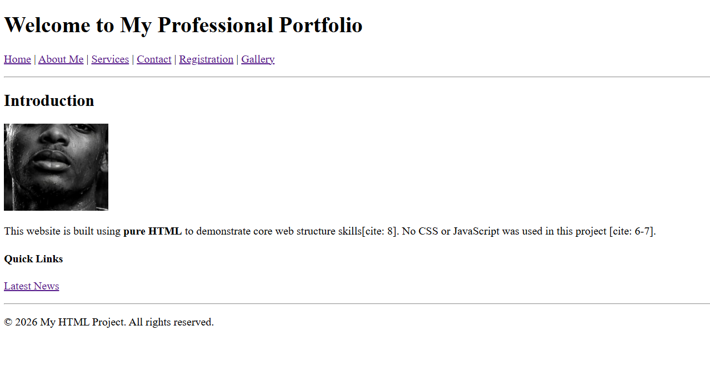

# HTML-Website
# HTML-Website documentation

## Project Overview
This project is a fully structured, multi-page website built strictly using **pure HTML**. The objective was to implement core HTML elements and semantic layout tags without the use of CSS or JavaScript.

## Features
- **Zero CSS/JS**: Every aspect of the site is handled by native HTML elements.
- **Semantic Structure**: Uses `<header>`, `<nav>`, `<main>`, `<article>`, and `<footer>` for layout.
- **Full Form Integration**: A comprehensive registration form with various input types.
- **Multimedia**: Embedded images, audio, video, and a Google Map.
- **Data Display**: Structured tables and lists for service descriptions.

## Website Screenshots

*Figure 1: Homepage layout showing navigation and semantic structure.*

(form.png)
*Figure 2: Comprehensive HTML form with fieldsets and various inputs.*

## File Structure
- `index.html`: Website introduction and navigation.
- `about.html`: Biographical information and address.
- `services.html`: Lists and tables of offerings.
- `contact.html`: Contact details and map iframe.
- `form.html`: Full user input form.
- `media.html`: Image gallery and multimedia.

## Design Mockup
The UI design for this project was first conceptualized in Figma.
(https://www.figma.com/design/5GTkj1D1MJp9YPpRLKOZr2/Website?node-id=0-1&p=f&t=fmWNOojuAH34K1Is-0)

## Technical Specifications
This project utilizes mandatory HTML tags including:
- **Internationalization**: `<bdi>`, `<bdo>`, `<ruby>`.
- **Interactive**: `
`, `
`.
- **Data/Time**: `<time>`, `<progress>`, `<meter>`.

## Deadline
Submitted on: January 26, 2026.
